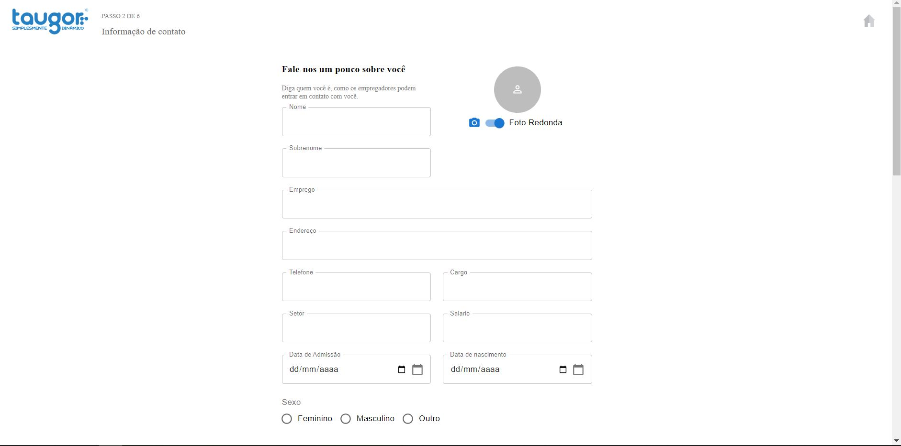
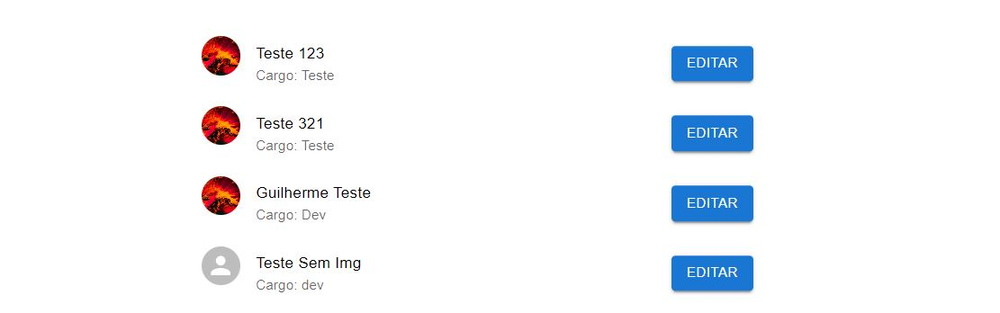
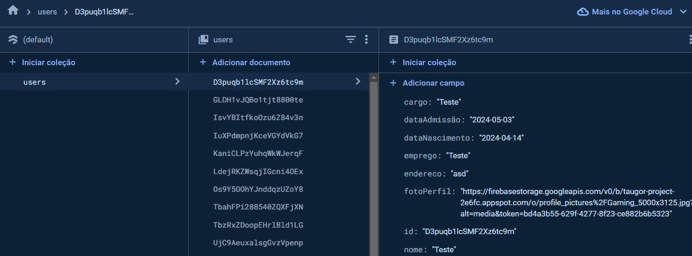
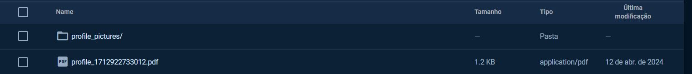

# Formulário de Cadastro e Atualização de Funcionários

## Visão Geral

Este componente de formulário é utilizado para o cadastro e atualização de informações de funcionários. Os usuários podem preencher campos com dados pessoais e profissionais, que são salvos no Firebase Firestore. Além disso, há funcionalidade para upload de fotos de perfil para o Firebase Storage.

## Tecnologias Utilizadas

- **React**: Biblioteca JavaScript para construção de interfaces de usuário.
- **Material-UI**: Biblioteca de componentes de UI para React que implementa o design do Material Design.
- **Firebase Firestore**: Banco de dados NoSQL para armazenamento de dados do formulário.
- **Firebase Storage**: Serviço de armazenamento de arquivos para guardar as fotos de perfil dos funcionários.
- **Axios**: Cliente HTTP baseado em promessas para fazer requisições HTTP.

# Microserviço de Manipulação de PDF

## Visão Geral

Este microserviço é responsável por gerar documentos PDF baseados em dados recebidos via API HTTP POST. Integra-se com o Firebase para armazenar os PDFs gerados e retorna URLs para acesso direto aos arquivos.

## Tecnologias Utilizadas

- **Node.js**: Plataforma de execução do lado do servidor.
- **Express.js**: Framework para aplicações web no Node.js.
- **PDFKit**: Biblioteca para geração de documentos PDF em Node.js.
- **Firebase Admin SDK**: Conectividade com Firebase para autenticação e armazenamento.
- **CORS**: Middleware para habilitar CORS.

# Visão Geral do Projeto

## Tela inicial

## Lista de Usuarios

## Firebase

## Armazenamento de Foto de perfil e PDF
